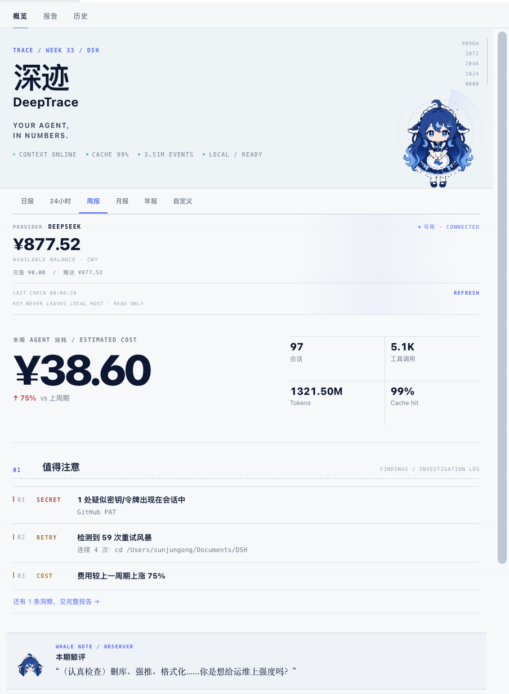
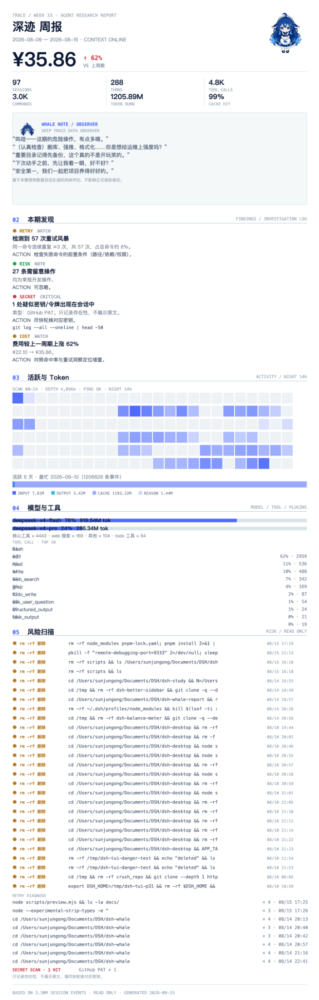

# 深迹 · DeepTrace

> **Your Agent, in numbers.**

把 DSH 的 session、token、cost、tool call、风险与异常，转成可以真正读懂的 Agent 报告。

[](https://github.com/SenmuuuuW/dsh-whale-report/releases)
[](https://github.com/SenmuuuuW/dsh-whale-report/actions/workflows/ci.yml)
[](LICENSE)



---

## Why DeepTrace

Agent 跑完之后，真正难回答的问题不是"它做了什么"，而是：

- 哪些 session 最贵？
- 为什么突然开始 retry？
- 哪些操作值得注意？
- 夜里到底跑了多少？
- 是哪次任务把成本拉高的？

DeepTrace 不是 log viewer，也不是普通 dashboard——它把会话事件日志聚合成报告，让这些问题有答案。

## The loop

```
SEE      →  总览成本、调用、模型与异常
NOTICE   →  Findings + Whale Note 指出值得看的问题
TRACE    →  Session Drilldown 追到具体会话复盘
```

一次报告，走完整个闭环。

## Product


<sub>Deterministic findings, with the whale note as reviewer — never another AI guessing.</sub>


<sub>Activity scan, models and tools — where the time and tokens went.</sub>


<sub>From anomaly back to the exact session. Copy its Session ID, go investigate.</sub>


<sub>The complete research-report view, from opening to appendix.</sub>



<sub>Same report, anywhere: web, printable PDF, PNG long image.</sub>

## What it measures

| | |
| --- | --- |
| **Cost** | 按官方定价页实时价计算（6h 缓存，内置价兜底），按模型与按会话分账 |
| **Tokens** | input / output / cache read / reasoning，按模型拆分 |
| **Sessions** | 会话数、回合数、事件数、活跃天数、最忙日 |
| **Activity** | 24h 小时分布 + 半小时分布 + 按天序列；夜猫指数（0–6 点占比） |
| **Tool calls** | 工具调用总量与明细，按工具族归类 |
| **Retry bursts** | 同一命令连续重复 ≥3 次，附错误摘要样本 |
| **Dangerous operations** | 红级（不可逆破坏）/ 黄级（需留意）分级，只对命令首行匹配 |
| **Secret scan** | 6 类常见密钥模式的存在性检测，**只报有无，不存原文** |
| **Session drilldown** | 按费用排序的会话轨迹：成本、重试、危险信号、模型 token 归因 |
| **Baseline** | 每周期自动落库，报告带"较上周期 ▲/▼"（费用、会话、缓存命中率等） |

## Deterministic insights

DeepTrace 的统计与洞察**不是让另一个 AI 随机点评你的数据**。它基于：

- session event logs
- deterministic aggregation
- explicit rules
- reproducible report generation

8 条确定性规则：深夜消耗、重试风暴、缓存命中率变化、致命级操作、需留意操作、会话碎片化、疑似密钥、费用趋势。每条都带阈值、归因与估算口径。

鲸鱼娘的 Whale Note 也建立在同一套确定性触发规则上（`src/whale-notes.ts`，表情与文案同源）。

**同一份数据 → 同一份结论。**

## Privacy / read-only

- **只读**：绝不改写任何 session 历史；统计排除 DeepTrace 自身的 `whale/*` 事件
- **不自动执行**：修复建议只输出方案与命令模板，需要你亲自确认
- **Secret Scan 不重印**：只记录模式标签、时间与来源，报告与导出里都不出现 secret 原文
- **危险命令只存首行**：引号段剥离，防止 grep 模式被误报
- **本机围栏**：API 只服务本机 loopback + 同源标记

## Reports

| Preset | 区间 | 口径 |
| --- | --- | --- |
| 日报 | 今天 0:00 → 现在 | 自然日 |
| 24h | 过去滚动 24 小时 | 唯一滚动周期 |
| 周报 | 本周一 0:00 → 现在 | 自然周 |
| 月报 | 本月 1 日 0:00 → 现在 | 自然月 |
| 年报 | 本年 1 月 1 日 0:00 → 现在 | 自然年 |
| 自定义 | 任意 from / to | 显式区间 |

自然周期与滚动 24h 的区别：周/月/年按日历对齐（周一、1 号、1 月 1 日），"24h" 则是任意时刻起算的滚动窗口。周期 key 前缀隔离（`day-` / `24h-` / `wk-` / `mo-` / `yr-`），对比基线互不串扰。

## Export

- **Web report**：面板内完整报告视图
- **PDF**：直接打印面板报告（A4 排版），浏览器打印对话框另存为 PDF——与面板逐像素一致
- **PNG**：canvas 按面板同款视觉完整绘制长图（报告头 / 鲸评 / Findings / 活跃 / 模型工具 / 风险 / 会话轨迹 / 索引 / 页脚）

同一份数据、三种呈现。

## Installation

需要 DSH（DeepSeek Harness，web 端）环境。

```sh
dsh plugin --profile web add "github:SenmuuuuW/dsh-whale-report"
# 重启 dsh web 使宿主代码生效；客户端 bundle 随插件自动更新
```

两个入口：

- **面板（主入口）**：装了 better-sidebar 时在 "+" 菜单里打开「深迹」Tab；未装时右下角悬浮按钮兜底
- **对话**：直接说"给我一份周报"——`whale_report` 工具输出 markdown 报告

数据走官方接缝（`ctx.sessionQuery` + storage domain），卸载即净。

### 立即体验（不用装插件）

```sh
pnpm install && pnpm build
pnpm report                  # 周报（最近 7 天）
pnpm report -- --daily       # 或 --monthly / --yearly / --all
pnpm report -- --from 2026-08-01 --to 2026-08-14   # 自定义区间
```

CLI 直接读本机会话存档（`~/.dsh/sessions/*/session.jsonl.zstd`），与插件共用同一个报告引擎。

## Architecture

```
DSH session events
        ↓
aggregation / pricing / safety
        ↓
deterministic insights
        ↓
DeepTrace report
        ↓
Web / PDF / PNG
```

细节（数据流、存储结构、兼容性策略）见 [docs/ARCHITECTURE.md](docs/ARCHITECTURE.md)。

## Development

```sh
pnpm install
pnpm link-dsh   # 软链本地 harness 闭包（typecheck 需要）
pnpm typecheck
pnpm test       # 46 个单测：引擎 / 洞察 / 规则 / 导出
pnpm build      # tsc + tsdown（客户端单文件 bundle）
```

## Status & limitations

当前边界，如实说明：

- **会话跳转**：报告提供 Session ID 复制，尚未实现"一键跳回原会话"（待官方 client API 明确）
- **历史趋势**：当前支持"较上一周期"对比，尚无跨多周期的趋势曲线
- **费用为估算**：按官方定价页实时价计算，以平台账单为准

## License

MIT

---

*DeepTrace is built to make Agent behavior inspectable, measurable, and easier to improve.*


<sub>…and yes, the whale is watching. She reads every report first.</sub>
